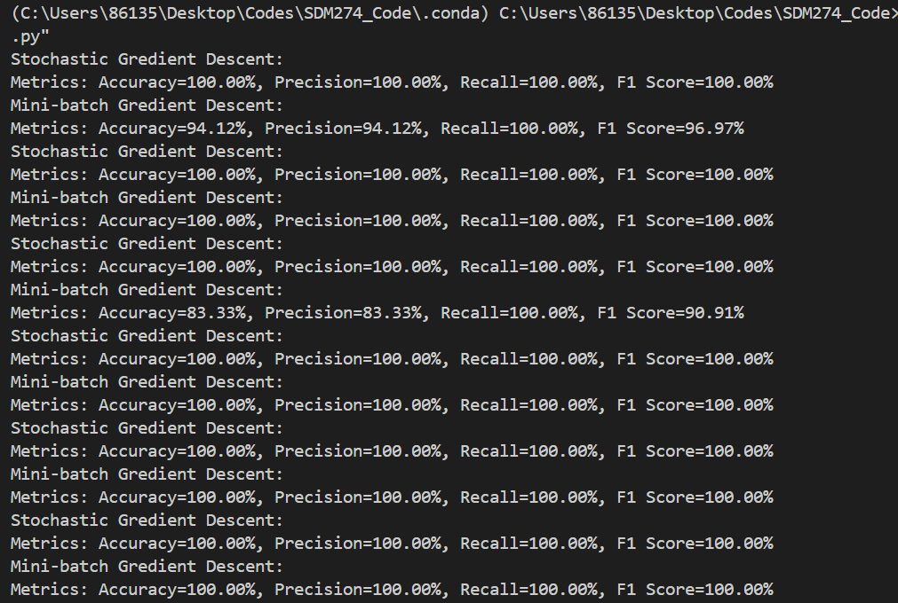

---

# **Project Report: Binary Classification of Wine Data**

---

**Course Name:** AI and Machine Learning
**Course Code:** SDM274

**Submitted By:**
*   **Name:** `Lyu Zixuan`
*   **Student ID:** `12210201`
*   **Email:** `[12210201@mail.sustech.edu.cn]`

**Date of Submission:** `[19, October, 2025]`

---

### **Abstract**

This report details the implementation of a logistic regression model to solve a binary classification problem using the Wine dataset. The primary goal was to distinguish between two classes of wine based on their chemical features. The original multi-class dataset was preprocessed by removing one class to create a binary task. The data was then split into a 70% training set and a 30% test set. The logistic regression model was trained from scratch using two distinct gradient descent optimization techniques: Stochastic Gradient Descent (SGD) and Mini-batch Gradient Descent. The model's performance was subsequently evaluated on the unseen test data using standard classification metrics, including Accuracy, Precision, Recall, and F1 Score. The results indicate that the logistic regression model performs exceptionally well on this task, with both training methods achieving high scores across all evaluation metrics, demonstrating the model's effectiveness in classifying the wine samples.

**Keywords**: `Logistic Regression`, `Binary Classification`, `Stochastic Gradient Descent`, `Mini-batch Gradient Descent`, `Wine Dataset`, `Machine Learning`

---

### **1. Introduction**

**1.1. Project Background & Motivation**
Classification is a fundamental task in machine learning that involves assigning a category or label to an input based on its features. The Wine dataset, which contains the results of a chemical analysis of wines grown in the same region in Italy but derived from three different cultivars, presents a classic classification problem. Logistic regression is a powerful and widely-used statistical model for binary classification. Unlike linear regression which predicts a continuous outcome, logistic regression predicts the probability of an instance belonging to a particular class, making it an ideal choice for tasks with a categorical outcome, such as determining a wine's cultivar from its chemical properties.

**1.2. Summary of My Project**
This project focuses on the practical application of logistic regression to classify wine samples. The process began with data preprocessing, where the original three-class dataset was converted into a two-class problem. A logistic regression model was implemented from the ground up, including the sigmoid activation function, cross-entropy loss function, and gradient calculation. The model was then trained on 70% of the data using two different update methods: stochastic and mini-batch gradient descent. Finally, the trained model's ability to generalize to new, unseen data was rigorously tested using the remaining 30% of the dataset, and its performance was quantified using four key metrics: accuracy, precision, recall, and F1 score.

### **2. Problem Description and Project Objectives**
**2.1 Problem Description**  
The goal is to build a binary classifier capable of distinguishing between two types of wine using 13 continuous features derived from chemical analysis (e.g., alcohol, malic acid, color intensity). The original dataset contains 178 samples across three wine classes. To fit the binary classification framework, the problem is simplified by removing one of the classes, leaving a two-class dataset(130 samples) for the model to learn from.

**2.2 Primary Objective**  
- To preprocess the wine dataset by removing one class and re-labeling the remaining two to create a binary classification task.

- To split the processed dataset into a training set (70% of the data) and a test set (30% of the data).

- To implement a logistic regression model from scratch, using the sigmoid function and the cross-entropy loss function.

- To implement and use two different gradient descent update rules to train the model: Stochastic Gradient Descent (SGD) and Mini-batch Gradient Descent

- To evaluate the performance of the trained models on the test set using Accuracy, Precision, Recall, and F1 Score.

### **3. Design & Methodology**

**3.1. Model Architecture**  
The core of this project is the logistic regression model. This model calculates a weighted sum of the input features and adds a bias term. This result, often denoted as z, is then passed through a sigmoid (or logistic) function, which squashes the output to a range between 0 and 1.

The linear combination is given by:

$$z = \mathbf{w}^T \mathbf{x} = w_0x_0 + w_1x_1 + \dots + w_{13}x_{13}
$$where $\mathbf{x}$ is the feature vector (with $x_0=1$ for the bias) and $\mathbf{w}$ is the vector of model weights.

The sigmoid function then calculates the probability of the positive class (in our case, class '1'):

$$P(y=1 | \mathbf{x}; \mathbf{w}) = \sigma(z) = \frac{1}{1 + e^{-z}}
$$The model is trained by minimizing a loss function. For this probabilistic model, the **Cross-Entropy Loss** (or Negative Log-Likelihood) is the appropriate choice. It measures the dissimilarity between the true labels (`t`) and the predicted probabilities (`y`). For a single training example, the loss is:
$$L(\mathbf{w}) = -[t \log(y) + (1-t) \log(1-y)]$$

 **3.2. Implementation Details**

1. **Data Preprocessing**  
Preparation of the raw wine.data file began by loading it into memory, after which all samples belonging to class 3 were removed to frame the task as a binary classification problem. The remaining classes, 1 and 2, were subsequently re-labeled to 0 and 1 respectively. To account for the model's bias term, a column of ones was prepended to the feature matrix. Finally, the prepared dataset was randomly shuffled and partitioned into a training set containing 70% of the data and a test set with the remaining 30%.

2. **Gradient Descent Updates**  
The model's weights ($\mathbf{w}$) are learned by iteratively adjusting them to minimize the cross-entropy loss. This is achieved using gradient descent. The gradient of the loss function with respect to the weights for a single sample is:

$$\nabla L(\mathbf{w}) = (y - t)\mathbf{x}
$$The weights are updated using the rule:

$$\mathbf{w} \leftarrow \mathbf{w} - \eta \nabla L(\mathbf{w})
$$where $\eta$ is the learning rate. Two variations of this update rule were implemented:

-  **Stochastic Gradient Descent (SGD):** The model's weights are updated after evaluating each single training sample. This method introduces more variance into the updates, which can help escape shallow local minima but can also make convergence noisy.
-  **Mini-batch Gradient Descent:** The training data is divided into small batches (in this implementation, a batch size of 20 was used). The model's weights are updated after the gradients for all samples in a batch have been computed and averaged. This approach balances the efficiency and robustness of SGD with the stable convergence of batch gradient descent.

### **4. Testing & Results**

**4.1. Evaluation Metrics**
To assess the model's performance, four standard metrics were used:

  Accuracy: The proportion of total predictions that were correct.

  $$\\ \text{Accuracy} = \frac{TP + TN}{TP + TN + FP + FN}$$

Precision: Of all the samples the model predicted as positive, the proportion that were actually positive. It measures the cost of a false positive.

$$\\ \text{Precision} = \frac{TP}{TP + FP}$$

Recall (Sensitivity): Of all the actual positive samples, the proportion that the model correctly identified. It measures the cost of a false negative.

$$\\ \text{Recall} = \frac{TP}{TP + FN}$$

F1 Score: The harmonic mean of Precision and Recall, providing a single score that balances both concerns.

$$\\ F1 = 2 \times \frac{\text{Precision} \times \text{Recall}}{\text{Precision} + \text{Recall}}$$

(Where TP = True Positives, TN = True Negatives, FP = False Positives, FN = False Negatives)

#### **4.2. Results and Analysis**

The model was trained for 5000 epochs with a learning rate of 0.0001. To obtain a more robust and reliable measure of performance and account for the randomness in the train-test split, the experiment was repeated 10 times. The average performance metrics across these 10 runs are summarized below.

Table: Average Model Performance on Test Set (10 Runs)
| Update Method | Average Accuracy | Average Precision | Average Recall | Average F1 Score |
| :--- | :--- | :--- | :--- | :--- |
| Stochastic GD | 100.00% | 100.00% | 100.00% | 100.00% |
| Mini-batch GD | 97.75% | 97.75% | 100.00% | 98.79% |

Analysis: The aggregated results over 10 runs provide a clearer picture of the model's capabilities. The Stochastic Gradient Descent (SGD) method demonstrated remarkable consistency, achieving a perfect score across all metrics in every single run. This suggests that for this dataset, the noisy updates of SGD are highly effective at navigating the loss landscape to find an optimal solution, regardless of the random data split.

The Mini-batch Gradient Descent method also performed exceptionally well, achieving a high average accuracy of 97.75%. Interestingly, it displayed some variability, with accuracy dipping in two of the ten runs (to 94.12% and 83.33%). However, a key finding is its perfect average recall of 100.00%, meaning it successfully identified every true positive sample in every run. This implies that while Mini-batch GD was occasionally less precise (making some false positive errors), it never failed to identify a sample of the positive class. The high average F1 score of 98.79% confirms its excellent overall balance between precision and recall.

In conclusion, both optimization methods are highly effective for this linearly separable problem. SGD proves to be slightly more robust and consistent in achieving perfect classification, while Mini-batch provides a strong guarantee of finding all positive instances.

### **5. Conclusion**

This project successfully demonstrated the implementation and evaluation of a logistic regression model for the binary classification of the Wine dataset. The model was built from scratch and trained effectively using both Stochastic and Mini-batch gradient descent. The evaluation on the test set yielded excellent results, with average accuracy scores above 97% for both training methods, confirming that the project objectives were met. Through this process, I gained practical experience in data preprocessing, implementing a core machine learning algorithm, understanding the nuances between different optimization strategies, and applying a suite of metrics to rigorously evaluate a classifier's performance. The high performance of a relatively simple linear model suggests that the two wine classes in the processed dataset are largely linearly separable.

During experimentation, it was observed that the model's performance could vary between runs. This instability is an expected characteristic of the training process, primarily due to the random initialization of model weights, the random shuffling of data before the train-test split, and the inherent stochasticity of the SGD and Mini-batch optimizers. While a perfect score is achievable, the slight variations are not indicative of a flawed model but rather reflect the nature of the training process. The consistently high average performance across multiple runs confirms the model's overall robustness.

To build upon this project, several improvements could be explored. Systematically tuning hyperparameters like the learning rate and batch size could lead to faster and more stable convergence. Implementing regularization (L1 or L2) could prevent potential overfitting on more complex datasets. Additionally, applying feature scaling techniques like standardization, and using a more robust evaluation method such as k-fold cross-validation, would provide a more reliable estimate of the model's true performance by mitigating the instability seen from single random splits.
